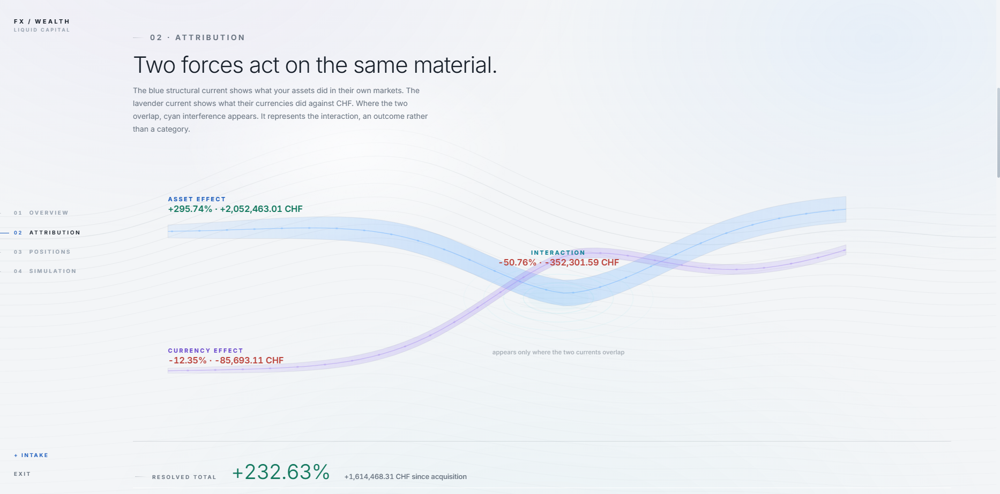
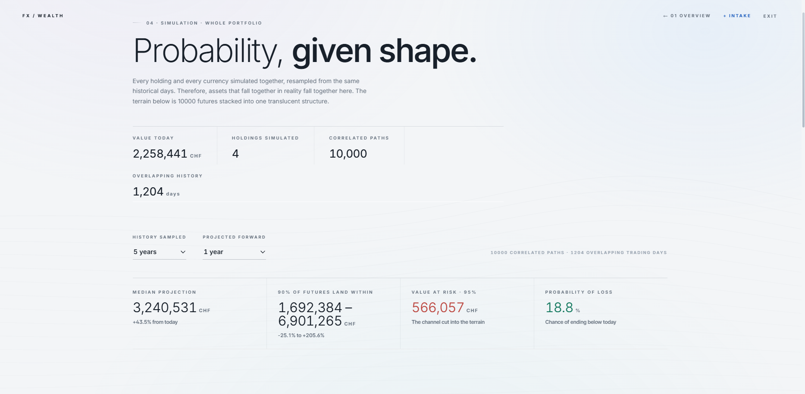

# FX Wealth Tracker

**Multi-currency portfolio analytics with proper FX attribution and Monte Carlo Simulation. A Swiss client holding US stocks needs to know whether their manager picked well or the dollar just moved, and this tool separates the two.**

Live demo: **[fx.gurevich.com](https://fx.gurevich.com)** · demo login: `demo` demo password: `wealth123`

## Stack

Django 4.2 · PostgreSQL (SQLite in development) · NumPy · pandas · yfinance · ECB SDMX API · WhiteNoise · Gunicorn · deployed on Railway with automatic migrations per release

---

## What it does

Cross-border wealth doesn't live in one currency. A typical private-banking client holds US equities in dollars, European positions in euros, London listings in pounds, and cash in francs, while thinking about their net worth in exactly one home currency.

When that portfolio is reported in the home currency, every return number conflates two different factors: how the asset performed in its own market, and how the exchange rate moved. FX Wealth Tracker separates them.

- **Multi-currency valuation**: every position valued daily in its native currency and translated to the portfolio's base currency at ECB reference rates
- **FX attribution**: each position's base-currency return decomposed into *asset effect* (local-market performance), *currency effect* (FX translation), and their interaction
- **Correlated Monte Carlo projection**: 10,000 simulated paths for the whole book, built by resampling actual historical days so that crashes stay correlated across assets and currencies
- **Risk metrics**: median projection, 90% outcome bands, 95% Value-at-Risk, probability of loss. All information is available per position and portfolio-wide
- **Data-quality screening**: positions with insufficient or inconsistent data are excluded from each analysis *with a stated reason*, never silently folded into a wrong number

## Screenshots

| Dashboard | Attribution |
|---|---|
|  |  |

| Monte Carlo projection | Per-analysis exclusion |
|---|---|
|  |  |

## Methodology

### FX attribution

For each position, with local-currency prices *p* and FX rates *s* (position currency → base currency):

```
r_local = p_end / p_start − 1          # asset effect (local market)
r_fx    = s_end / s_start − 1          # currency effect (translation)
r_base  = (1 + r_local)(1 + r_fx) − 1  # total base-currency return
```

The decomposition is multiplicative: `r_base = r_local + r_fx + r_local·r_fx`, with the cross-term reported separately as the *interaction effect* rather than smeared into either component. Money effects are computed against each position's starting base-currency value and summed to portfolio level, so the identity *initial value + total effects = current value* holds exactly.

### Monte Carlo simulation

Forward projections use **historical date bootstrapping** rather than a parametric model. Each simulated day draws one actual historical date and applies that day's *joint* growth factors. Every asset's return and every FX rate's move from the same calendar day to the simulated portfolio.

Why: sampling each series independently would let one asset's bad day offset another's good day, overstating diversification and understating tail risk. Drawing whole days preserves the empirical correlation structure, fat tails and all, with no covariance matrix to estimate and no distributional assumption to defend. Instruments with insufficient overlapping history (fewer than 500 shared trading days) are excluded from simulation with an explicit note.

### Value-at-Risk convention

VaR-95 is reported as the loss to the 5th-percentile outcome. At long horizons, bootstrapped drift can lift even the 5th-percentile path above today's value; the dashboard then reports **"no loss at 95% confidence"** rather than a negative VaR. Long-horizon projections inherit the character of the sampled decade. This is a limitation stated, not hidden.

### Data handling

- Listed instruments are priced daily via Yahoo Finance; FX rates come from the ECB reference-rate series (2000 → today), with USD/CHF/GBP crosses derived through EUR
- London listings quoted in pence (GBp) are normalized to pounds at ingestion
- NaN values from the data provider are rejected at the write boundary, they never enter the price table
- A position whose declared currency conflicts with its stored price currency is excluded from valuation, attribution, and simulation alike, each with a visible reason
- Non-listed assets (real estate, private holdings) carry manual valuations

The public demo portfolio intentionally includes a thin-history listing to show the per-analysis screening in action: the position is valued and attributed, but excluded from simulation with an explicit reason.


## Running locally

```bash
git clone https://github.com/Leonid2004/FX_WEALTH_DEPLOY.git
cd FX_Wealth_Tracker_Public
python -m venv venv
venv\Scripts\activate          # Windows  ·  source venv/bin/activate on macOS/Linux
pip install -r requirements.txt

python manage.py migrate       # build the schema
python manage.py backfill      # load FX history (2000→today) + price history for held tickers
python manage.py createsuperuser
python manage.py runserver
```

Register through the UI to create a portfolio, add positions, and the tracker fetches price history for new tickers automatically. Re-run `backfill` any time. The command is idempotent.

### Tests

```bash
python manage.py test          # 48 tests
```

The suite covers the attribution identity against hand-derived values, Monte Carlo reproducibility and constant-growth convergence, pence normalization, thin-history and currency-mismatch exclusions, data-gap rejection, and per-user data isolation. Tests run fully offline, all market data is seeded, none fetched.

## Limitations

- Four currencies (CHF, USD, EUR, GBP); adding one means extending the ECB series mapping and the currency choices
- Listed assets are auto-priced; everything else is manual valuation
- Simulation resamples the past — it answers "what if the future rhymes with the sampled decade," which is a modeling choice, not a forecast
- Single-portfolio-per-user by design; this is an analytics tool, not a custody system

## Author

Built by Leo Gurevich
https://www.linkedin.com/in/leonid-gurevich-/
